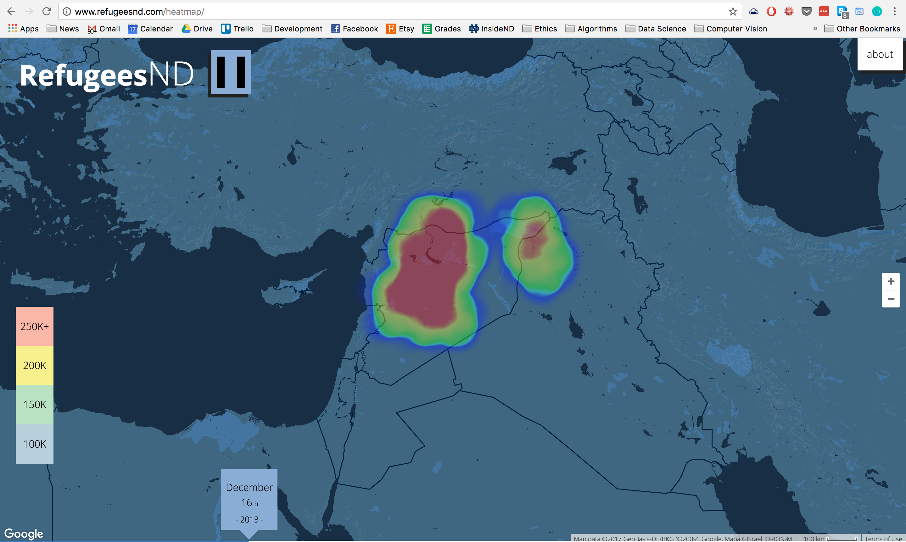

# RefugeesND (Fall 2015)
A heatmap visualization of the Syrian refugee crisis

*Coded in JavaScript via Google Maps API*

----
## Overview
Over my fall break in 2015, I built a website to provide resources for Notre Dame students who want to learn more about the underlying causes of the present refugee crisis as well as to help those students identify concrete ways they might serve the needs of refugees in the Middle East.

RefugeesND is a joint undergraduate-graduate student initiative to raise campus awareness on the plight of the four million persons that have fled Syria since 2011.

----
## The Details
RefugeesND is a website that is intended to provide easy to access facts and figures regarding the present refugee crisis in the Middle East. One of the main features of this website is an interactive heat map timeline that visualizes the forced migration of registered Syrian refugees since 2013. This tool allows representation of three dimensions of data: the location of refugees, the number of refugees, and a timestamp. The website also serves as a springboard for a collaborative research project between undergraduate and graduate students at The University of Notre Dame on the history and underlying causes of the mass displacement of persons in the Middle East since 2011. The aim of that project is not only to do interdisciplinary research, but also to help organize on-campus events regarding the global refugee crisis and provide resources for undergraduate students who are interested in working directly in support of refugees.

At bottom, the website and collaborative project function as vehicles for raising awareness about the plight of refugees, paying particular attention to the ways in which the exercise of religious liberty goes hand-in-hand with meaningful access to stable lodging, labor and land. Where local governments are unable or unwilling to provide citizens with what Pope Francis has called the “absolute minimum” of human dignity, the result oftentimes is to the detriment of their material and spiritual flourishing, especially religious minorities. We hope that RefugeesND can be a social media tool by which students can learn more about the crisis and ways they can help with their prayers and their discipline-specific expertise.